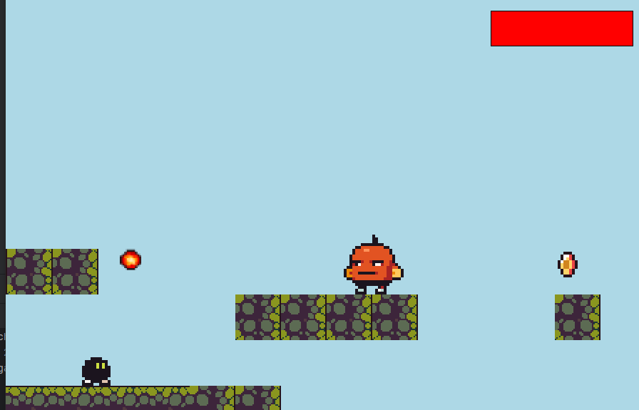

# Проект: Платформер
## Скрин игры:

## Что есть в игре:

- преодоление препятствий;
- сбор монет;
- враги;
- много локаций;
- разные уровни.
## Применённые технологии:
- создание и использование карт через Tiled
- Загрузка карт в pygame из сторонего приложения
- структура для создания разных уровней
- npc противника и идущий за игроком
